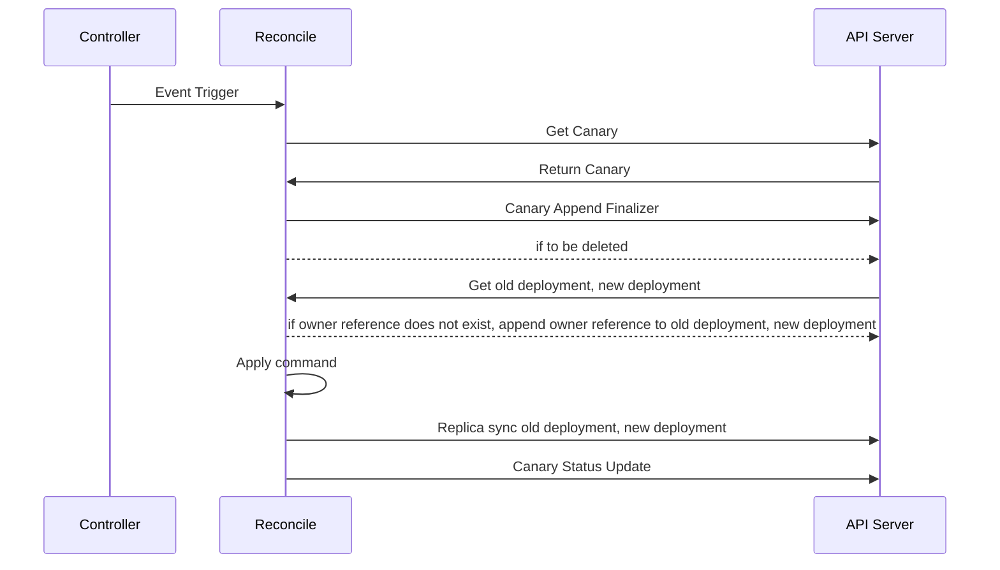

# Introduction
쿠버네티스(Kubernetes)는 컨테이너화된 애플리케이션을 관리하고 배포하는 데 있어 강력한 플랫폼입니다. 그러나, 새로운 기능이나 업데이트를 배포하는 과정에서 안정성을 보장하는 것은 매우 중요합니다.
이를 위해 많은 조직에서는 Canary 배포 전략을 사용하고 있습니다. Canary 배포는 소수의 사용자에게만 새로운 버전을 배포하여 문제가 없는지 확인한 후, 점진적으로 모든 사용자에게 배포하는 방식입니다.
이를 통해 배포 과정에서 발생할 수 있는 문제를 최소화할 수 있습니다. Canary Operator는 Kubernetes 환경에서 Canary 배포 전략을 간편하게 사용할 수 있도록 도와주는 도구입니다.
이 Operator를 사용하여 새로운 버전을 점진적으로 배포하고 관리하는 방법에 대해 알아보겠습니다.

# Canary Operator란
Canary Operator는 쿠버네티스 클러스터에서 Canary 배포를 자동화하고 관리하는 데 사용되는 강력한 도구입니다. 이 Operator는 Custom Resource Definition(CRD)인 Canary를 정의하여, 사용자들이 이를 통해 Canary 배포를 설정하고 효과적으로 관리할 수 있도록 지원합니다. Canary Operator는 설정된 스케줄에 따라 주기적으로 Old Deployment와 New Deployment의 레플리카 수를 조정하여 Canary 배포를 자동으로 수행합니다. 이를 통해 시스템의 가용성과 안정성을 유지하면서도 새로운 기능을 점진적으로 배포할 수 있습니다.
Canary Operator는 Canary 배포 전략을 손쉽게 구현할 수 있게 해줍니다. 사용자는 Canary CRD를 통해 배포 과정에 필요한 모든 설정을 지정할 수 있습니다. 예를 들어, Old Deployment와 New Deployment의 이름, Canary 배포를 수행할 시간 간격, 한 번에 배포할 레플리카 수 등을 정의할 수 있습니다. Canary Operator는 이러한 설정에 따라 자동으로 배포를 관리하여 사용자의 개입 없이도 안정적인 배포를 가능하게 합니다.
또한, Canary Operator는 Canary 배포를 수행하는 동안 주기적으로 배포 상태를 모니터링하고 필요에 따라 조정합니다. 이를 통해 배포 과정에서 발생할 수 있는 문제를 사전에 감지하고 대응할 수 있습니다. 예를 들어, 새로운 버전에서 오류가 발생하면 Canary Operator는 자동으로 롤백을 수행하여 시스템의 안정성을 유지합니다. 이와 같은 기능은 운영자에게 큰 도움이 되며, 배포 과정에서 발생할 수 있는 위험을 최소화할 수 있습니다.
결론적으로, Canary Operator는 쿠버네티스 환경에서 Canary 배포를 자동화하고 효율적으로 관리할 수 있는 도구입니다. Operator SDK를 사용하여 개발되었습니다.
설정된 스케줄에 따라 Old Deployment와 New Deployment의 레플리카 수를 조정하여 안정적인 배포를 보장합니다. 이를 통해 애플리케이션의 가용성과 안정성을 높이고, 배포 과정에서 발생할 수 있는 문제를 최소화할 수 있습니다. Canary Operator를 사용하면 보다 안정적이고 신뢰할 수 있는 배포 프로세스를 구축할 수 있습니다.

# Canary Operator의 주요 기능
Canary Operator는 다음과 같은 주요 기능을 제공합니다.
- Canary CRD 정의: Canary 리소스를 정의하여 Canary 배포를 설정하고 관리할 수 있습니다.
- 배포 전략 설정 : Canary Operator는 설정된 스케줄에 따라 주기적으로 Old Deployment의 레플리카 수를 줄이고 New Deployment의 레플리카 수를 늘립니다. 이를 통해 점진적으로 새로운 버전을 배포할 수 있습니다. 예를 들어, 스케줄이 매 시간마다 2개씩 New Deployment의 레플리카 수를 늘리는 것으로 설정되어 있다면, 매 시간마다 Old Deployment의 레플리카 수를 2개씩 줄이고 New Deployment의 레플리카 수를 2개씩 늘리게 됩니다.
- 자동 롤백 : Canary 배포 중 문제가 발생할 경우, Canary Operator는 자동으로 롤백을 수행합니다. 이는 새로운 버전이 안정적이지 않은 경우 빠르게 이전 버전으로 복구할 수 있도록 합니다. 롤백 조건은 Pod의 Container에 문제가 발생하여 CrashLoopBackOff 상태가 되었을 때 자동으로 수행됩니다.

# Canary Operator의 동작
Canary Operator는 컨트롤러로부터 이벤트 트리거를 수신하게 되면 API 서버로부터 Canary 리소스를 가져와 작업을 시작합니다.
이 과정에서 Canary 리소스에 Finalizer를 추가하고, 리소스 삭제 여부를 확인합니다. 그 후, Old Deployment와 New Deployment를 가져와 Owner Reference가 없는 경우 Owner Reference를 추가합니다.
Deployment에 Owner Reference를 추가하게 되면 Deployment의 이벤트가 Canary 리소스에 전달되어 Deployment의 문제 발생 여부를 확인할 수 있습니다. 이를 이용하여 새로운 버전의 배포가 안정적인지 확인할 수 있으며, 문제가 발생할 경우 자동적으로 롤백을 수행할 수 있습니다.
마지막으로 Apply 명령을 실행하여 Deployment의 Replica를 동기화하고 Canary 상태를 업데이트합니다.


# Canary Operator 구성
Canary Operator를 구성하는 방법은 다음과 같이 yaml 파일을 작성하여 쿠버네티스 클러스터에 배포할 수 있습니다.
Canary Operator를 배포하는 과정에서 중요한 점 중 하나는 Canary 리소스와 동일한 Namespace에 Old Deployment와 New Deployment가 존재해야 한다는 것입니다. 이는 Canary Operator가 올바르게 동작하기 위한 필수 조건입니다. Canary Operator는 Canary 리소스를 기반으로 Old Deployment와 New Deployment의 레플리카 수를 조정하여 배포를 수행하기 때문에, 이 두 Deployment가 같은 Namespace 내에 있어야 원활하게 동작할 수 있습니다.
```yaml
apiVersion: canary.k8shuginn.io/v1alpha1
kind: Canary
metadata:
  name: canary-sample
  namespace: default
spec:
  oldDeployment: old-deployment
  newDeployment: new-deployment
  totalReplicas: 10
  stepReplicas: 2
  cronSchedule: "* * * * *"
  enableRollback: true
```
- oldDeployment: 이전 버전의 Deployment 이름
- newDeployment: 새로운 버전의 Deployment 이름
- totalReplicas: 전체 Replicas 수
- stepReplicas: 한 번에 배포할 Replicas 수
- cronSchedule: 배포 스케줄 (Cron 표현식 : 분 시 일 월 요일)
- enableRollback: 문제 발생 시 롤백 기능 활성화 여부를 나타냅니다. (true: 활성화, false: 비활성화)

# Canary 리소스 사용하기
Canary 리소스를 생성하였다면 바로 동작하는 것이 아닌 Pending 상태로 대기하며, Canary가 정상적으로 동작하기 위해서는 이전 버전의 oldDeployment와 새로운 버전의 newDeployment가 존재해야 합니다.
만약 oldDeployment 또는 newDeployment가 존재하지 않는다면 Canary 리소스는 Error 상태로 변경됩니다. 
`kubectl get canaries.canary.k8shuginn.io` 명령어를 이용하여 사용자는 Canary 리소스의 상태를 확인하고, 배포를 시작할 준비가 되었을 때 Canary 리소스를 실행할 수 있습니다.
Canary 리소스가 Pending 상태로 대기 중인지, 정상적으로 배포 준비가 되었는지, 혹은 Error 상태에 있는지를 확인할 수 있습니다. 이렇게 Canary 배포 전략을 사용하면 새로운 버전을 점진적으로 배포하고, 발생할 수 있는 문제를 초기에 감지하여 빠르게 대응할 수 있습니다.
이를 통해 시스템의 안정성과 가용성을 높이며, 사용자 경험을 개선할 수 있습니다. Canary Operator와 함께 사용되는 Kubernetes의 자동화 기능은 이러한 배포 과정을 더욱 효율적으로 관리할 수 있게 도와줍니다.
```bash
kubectl get canaries.canary.k8shuginn.io -o wide
# Result
NAME            OLDREPLICAS   NEWREPLICAS   CURRENTSTEP   STATE   MESSAGE
canary-sample   10            0             0             stop    Canary is Pending
```
- OLDREPLICAS: 이전 버전의 Replicas 수
- NEWREPLICAS: 새로운 버전의 Replicas 수
- CURRENTSTEP: 현재 배포 단계
- STATE: Canary 상태
- MESSAGE: 상태 메시지

Canary 리소스를 확인한 후 배포를 시작하려면 다음같이 apply 명령어를 사용하여 Canary를 실행할 수 있습니다.
```bash
kubectl annotate canary canary-sample canary.k8shuginn.io/command=apply

kubectl get canaries.canary.k8shuginn.io -o wide
# Result
NAME            OLDREPLICAS   NEWREPLICAS   CURRENTSTEP   STATE     MESSAGE
canary-sample   8             2             1             running   Canary is Running
```
canary.k8shuginn.io/command의 종류는 다음과 같습니다.
- apply: 배포를 시작 또는 재개합니다.
- stop: 배포를 일시 중지합니다.
- rollback: 즉시 강제로 이전 버전으로 롤백을 수행합니다.
- completion: 즉시 강제로 새로운 버전으로 전환합니다.

# Canary Operator Rollback
Canary 배포 중 문제가 발생하였을 경우, Canary Operator는 자동으로 롤백을 수행합니다. 롤백은 Canary 리소스의 enableRollback 필드를 true로 설정되어 있으면, 배포 중 문제가 발생할 경우 Canary Operator가 자동으로 롤백을 수행하는 기능을 제공합니다.
이 설정은 시스템의 안정성을 유지하는 데 중요한 역할을 하며, 배포 중단이나 오류 발생 시 빠르게 원래 상태로 복구할 수 있습니다. 이를 통해 지속적인 서비스 가용성을 보장할 수 있습니다.
롤백이 수행되었을 경우, Old Deployment로 롤백되며 Canary 리소스의 상태는 다음과 같이 롤백을 수행한 시간과 함께 표시됩니다.
```bash
kubectl get canaries.canary.k8shuginn.io -o wide
# Result
NAME            OLDREPLICAS   NEWREPLICAS   CURRENTSTEP   STATE   MESSAGE
canary-sample   10            0             0             stop    [2024-08-03T22:00:32+09:00] Canary is rollbacked
```

# Canary Operator Completion
Canary 배포가 완료되었을 경우, 다음과 같이 Canary 리소스의 상태가 complete로 변경됩니다. 이 상태는 Canary 배포가 완료되었음을 나타내며, 사용자는 새로운 버전의 배포가 안정적으로 완료되었음을 확인할 수 있습니다.
```bash
kubectl get canaries.canary.k8shuginn.io -o wide
# Result
NAME            OLDREPLICAS   NEWREPLICAS   CURRENTSTEP   STATE      MESSAGE
canary-sample   0             10            5             complete   Canary is complete
```